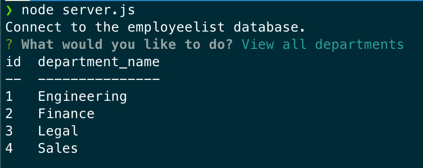

# Employee Tracker

## Description

Employee Tracker is an application that lets the user perform a series of operation such as adding departments, managers, roles, and employees. It also lets the user update relevant information about the above entities.

## Installation

To run the application:

- Run the command `npm init -y` to set up a new npm package
- Run the command `npm i` to install the prerequisites
- Run the command `npm i inquirer` to install the inquirer package
- Run the command `npm install express --save` to install the express package
- Run the command `npm install --save mysql2` to install the mysql2 package
- Run the command `npm install console.table --save` to install the console.table package
- Run the command `node server.js`to start the server
- Navigate to the db directory and enter the command `mysql -u root -p` to start a local session of mysql
- Run the command `source schemal.sql` and `source seeds.sql` to create a database and populate its tables

## Usage

Follow and answer the prompts in the terminal to keep track of employees

  

## Credits

hugh18019  
GitHub Profile: https://github.com/hugh18019

## Links

Walkthrough demo:
https://drive.google.com/file/d/1Hj_krKo28FEkVDwYzUdVY8ZnXlQd7qPL/view?usp=sharing

## License

Licensed under the [MIT License](LICENSE).
